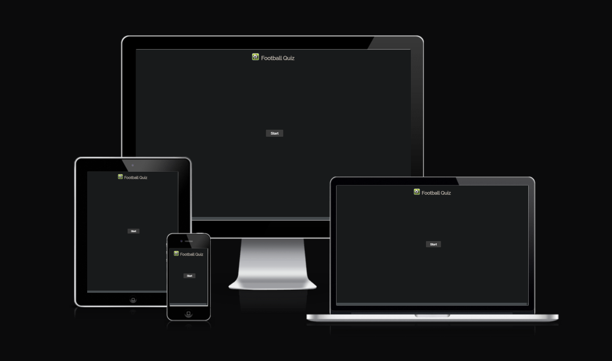
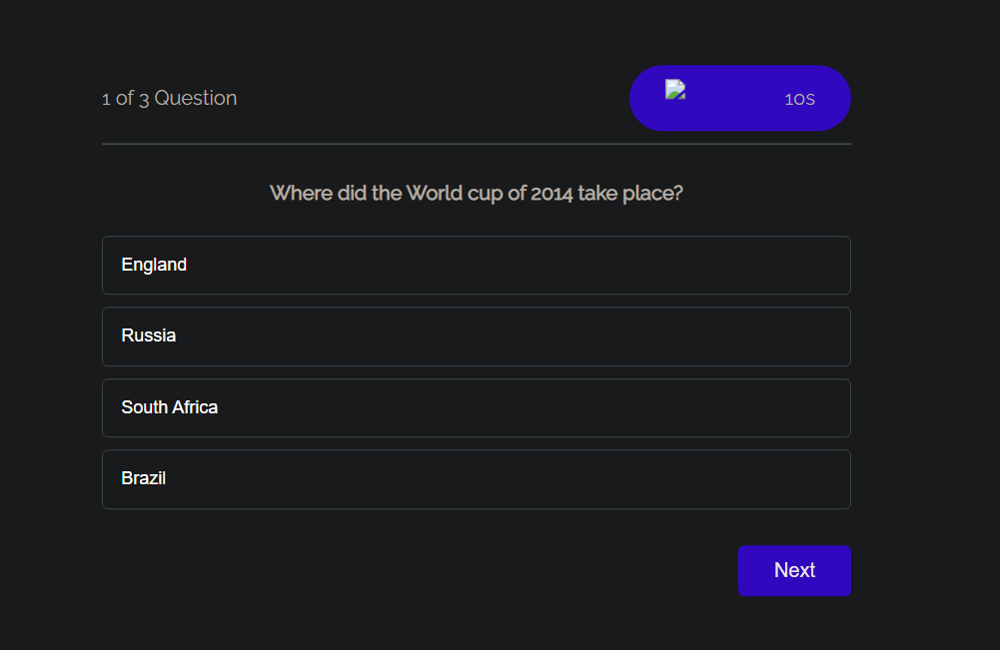
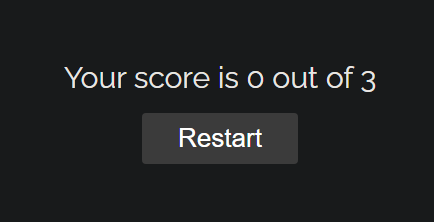

# Football Quiz

## Existing Features

- __Football Quiz Logo and Heading__

    - Featured at the top of the page, the Football Quiz logo and heading is easy to see for the user. Upon viewing the page, the user will be able to see the name of the page and the purpose.

- __The Game Area__

    - This section will allow the user to play the maths game. The user can easily see the timer, question and answers.
    - The user can choose to skip the question by clicking the "Next" button.

- __The Score Area__

    - This section will allow the user to see exactly how many correct and incorrect answers they have provided aswell as being able to restart the quiz.

